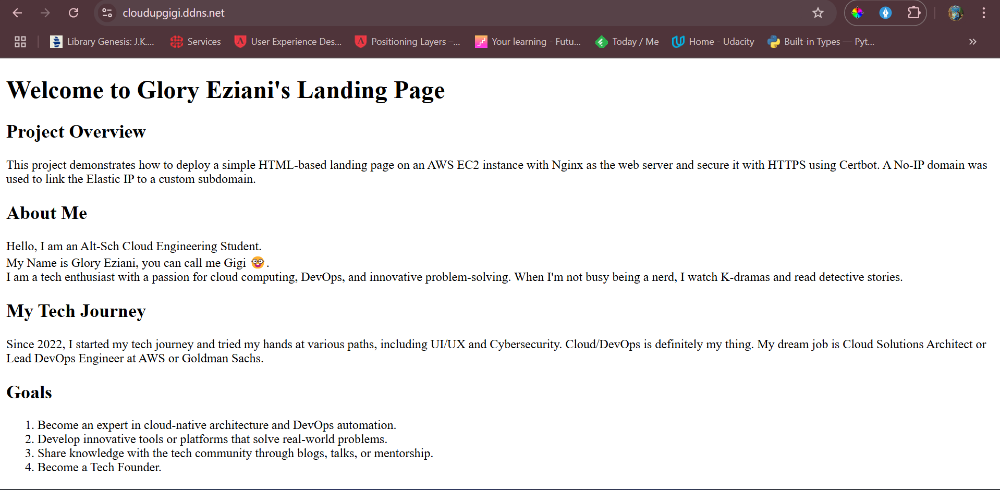

# Alt-Sch-Web-App-Prototype

## Project Overview  
This is a simple landing page hosted on an AWS EC2 instance. It showcases a basic web application prototype with information about Glory Eziani.  

## Features  
- A landing page with bio, tech journey, and goals.  
- Hosted on an Nginx web server.  
- Secured with HTTPS using Certbot.  

## Deployment Instructions  
(TBD: Will update as we progress through server provisioning and deployment.)  

## Public Access  
(TBD: Public IP or URL will be added after deployment.)  

## Screenshots  
Below is a screenshot of the deployed landing page viewed in a browser:  

  

